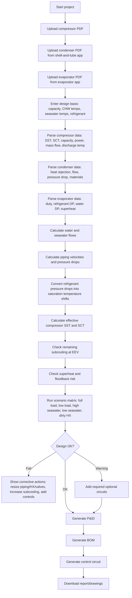

# Marine Chiller Design Logic Flow

```mermaid
flowchart TD
A[Start project] --> B[Upload compressor PDF]
B --> C[Upload condenser PDF from shell-and-tube app]
C --> D[Upload evaporator PDF from evaporator app]
D --> E[Enter design basis: capacity, CHW temps, seawater temps, refrigerant]
E --> F[Parse compressor data: SST, SCT, capacity, power, mass flow, discharge temp]
F --> G[Parse condenser data: heat rejection, flow, pressure drop, materials]
G --> H[Parse evaporator data: duty, refrigerant DP, water DP, superheat]
H --> I[Calculate water and seawater flows]
I --> J[Calculate piping velocities and pressure drops]
J --> K[Convert refrigerant pressure drops into saturation temperature shifts]
K --> L[Calculate effective compressor SST and SCT]
L --> M[Check remaining subcooling at EEV]
M --> N[Check superheat and floodback risk]
N --> O[Run scenario matrix: full load, low load, high seawater, low seawater, dirty HX]
O --> P{Design OK?}
P -- Fail --> Q[Show corrective actions: resize piping/HX/valves, increase subcooling, add controls]
P -- Warning --> R[Add required optional circuits]
P -- OK --> S[Generate P&ID]
R --> S
S --> T[Generate BOM]
T --> U[Generate control circuit]
U --> V[Download report/drawings]
```